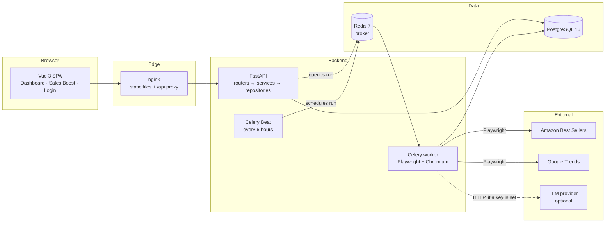

# Trend Radar

A service that finds promising products on Amazon and scores them, so buyers
stop doing the research by hand.

It scrapes Amazon best sellers with Playwright, checks demand dynamics on Google
Trends (also with Playwright), compares each product against our own history of
past winners, and turns all of that into a **0–100 score with a written
reasoning**. Everything heavy runs in Celery, so the API never blocks.

---

## Quick start

```bash
cp .env.example .env
docker compose up --build
```

That is the whole setup. Migrations, the admin account and demo data are
created automatically by the container entrypoint — there is no manual step
afterwards.

| What | Where |
| --- | --- |
| **Dashboard** | http://localhost:3011 |
| API | http://localhost:8011/api |
| Swagger | http://localhost:8011/docs |
| Health | http://localhost:8011/api/health |

**Test account: `admin` / `admin123`**

Host ports are deliberately non-standard (3011 / 8011 / 5442 / 6390) so the
stack does not clash with anything else running locally. Change them in `.env`.

> **No API key is needed.** The project ships with `LLM_PROVIDER=none` and scores
> with a deterministic formula. Adding a key switches scoring to the LLM without
> any other change.

---

## Architecture



### The pipeline

One Celery task, `run_pipeline`, does the whole cycle. The dashboard button and
Celery Beat call the exact same code path — only the `trigger` field differs.

```
scrape           trends              scoring
─────────        ─────────           ─────────
Chromium    →    Chromium       →    boost   ──┐
5 category       per keyword,        (our past │
pages,           captures the        winners)  ├─→  score 0-100
top N each       widget JSON                   │    + reasoning
                                    LLM or ────┘         ↓
                                    formula          PostgreSQL
```

Every stage writes its counters onto a `ScrapeRun` row, so the UI shows real
progress instead of an indefinite spinner, and a blocked scraper is visible
rather than silently reported as success.

### Layers

| Layer | Responsibility | Never does |
| --- | --- | --- |
| `app/api/routers/` | validate input, call **one** service method, return a response schema | business logic, SQL |
| `app/services/` | all rules and orchestration; owns the transaction | knows nothing about HTTP or Celery |
| `app/repositories/` | SQLAlchemy queries only | never commits, holds no rules |
| `app/models/` | ORM tables | logic in methods |
| `app/schemas/` | Pydantic DTOs | |
| `app/celery/` | the Celery app and its tasks: open a session, call a service | |
| `app/integrations/` | the outside world: Playwright scrapers, LLM adapters | |
| `app/utils/` | pure helpers: no database, no network, no config | |

**ORM objects never reach the client.** Services return ORM rows or plain
dataclasses; the router is the boundary that turns them into a response schema,
and every endpoint declares a `response_model`. That keeps serialisation in one
predictable place instead of half in the service and half in the router.

Each scraper is split in two: a **pure HTML → data function** and a thin
Chromium driver. That is why the parser is tested against saved snapshots in
milliseconds, and why a layout change on Amazon means fixing one function.

### Why the handlers are synchronous

Endpoints are plain `def`, not `async def`. SQLAlchemy and psycopg are
synchronous here, and FastAPI runs a sync handler in a threadpool, so concurrent
requests are still served — whereas a synchronous database call inside an
`async def` would block the event loop and serialise them.

The work that actually takes minutes — scraping, trends, scoring — runs in
Celery, which is where "asynchronously, without blocking the API" is satisfied:
`POST /api/scrape-runs` queues the job and returns `202` in about 20 ms while
the pipeline keeps running in the worker. The same services are shared by the
HTTP layer and the Celery task, and Celery is synchronous, so an async service
layer would need an event loop inside the worker for no gain.

Full notes: [ARCHITECTURE.md](ARCHITECTURE.md).

---

## How scoring works

Both branches — LLM and formula — return the same contract: an integer 0–100
and a written reasoning. Both are stored.

**Internal Sales Boost.** A scraped product is compared against our past
successful products. Points are awarded once per fact, not per matching row —
ten past winners in one category does not make a new product ten times better.

| Signal | Points |
| --- | --- |
| Category matches | 10 |
| Each shared keyword | 6, capped at 20 |
| **Maximum boost** | **30** |

**Fallback formula** (used when no API key is set, and whenever an LLM call
fails):

| Component | Weight | Notes |
| --- | --- | --- |
| Rating | 25 | unknown rating scores neutral, not zero |
| Reviews | 20 | logarithmic — 10 vs 1 000 matters, 90 000 vs 100 000 does not |
| Google Trends | 25 | logarithmic and symmetric around the yearly average |
| Sales Boost | 30 | the table above |

The full breakdown is stored with every score, so any rating can be rechecked
by hand.

**With an LLM key** the model receives the product data, the trend reading and
the boost, and returns its own score and reasoning. The formula breakdown is
still saved alongside. Any LLM problem — missing key, timeout, 429, invalid
JSON — moves that one product onto the formula and logs why. A failure never
turns into a silent zero.

Supported providers: `anthropic`, `openai`, `gemini`, `grok`, `none`.

**Time budget.** Those 40 products are scored one after another, so a slow
provider — 30 s per call, three attempts on a 429 — could spend the whole Celery
soft limit on scoring alone and have the task killed mid-run. Scoring therefore
has its own budget (`SCORING_BUDGET_SECONDS`, 15 minutes by default). Once it is
gone the remaining products are scored by the formula and their reasoning says
so, which keeps the guarantee that a run always finishes and every product
carries a score.

**Rate limits.** One run scores up to 40 products back to back, which is enough
to hit the quota on a provider's free tier. A `429` or a 5xx is retried twice
with a short backoff, honouring `Retry-After` when the provider sends it; a
wrong key or an unknown model is not retried, because those never pass. If the
quota is genuinely exhausted, each product falls to the formula and the log says
which one and why — the run still completes and every product keeps a score.

---

## Configuration

Everything lives in `.env`; `.env.example` carries working defaults for the
whole stack. The settings worth knowing:

| Variable | Default | Meaning |
| --- | --- | --- |
| `LLM_PROVIDER` | `none` | `none` = deterministic formula, no key required |
| `LLM_API_KEY` | empty | provider key; empty also falls back to the formula |
| `SCORING_BUDGET_SECONDS` | `900` | how long one run may spend asking the LLM; after that the rest is scored by the formula |
| `AMAZON_CATEGORY_URLS` | 5 category pages | comma separated |
| `SCRAPE_MAX_PRODUCTS` | `8` | **per category**, so 5 × 8 = 40 per run |
| `SCRAPE_INTERVAL_HOURS` | `6` | the Celery Beat schedule |
| `SCRAPE_PROXY` | empty | optional, for IP ranges Amazon blocks |
| `SCRAPE_SNAPSHOT_FALLBACK` | `true` | see below |
| `ADMIN_USERNAME` / `ADMIN_PASSWORD` | `admin` / `admin123` | seeded on startup |

**Why category pages and not the root `/Best-Sellers/zgbs`:** on the root every
product is labelled "Amazon Best Sellers", which would make the boost by
category match either everything at once or nothing.

**Snapshot fallback.** Amazon blocks some IP ranges outright. If a live scrape
returns nothing, the run falls back to a bundled HTML snapshot so the dashboard
is not empty — and the run is marked `partial`, never `success`, so a dead
scraper stays visible.

---

## Running the tests

```bash
pip install -r requirements-dev.txt
docker compose up -d postgres      # the API tests need a real Postgres
pytest -q
ruff check .
```

185 tests. The database tests need Postgres because the code relies on JSONB,
ARRAY and `DISTINCT ON`, none of which SQLite provides. Without a database they
skip, so the pure unit tests still run anywhere — except in CI, where
`REQUIRE_TEST_DB=1` turns that skip into a failure. A green CI run that quietly
tested nothing is worse than a red one.

Against a running stack:

```bash
./scripts/smoke.sh
```

It walks the reviewer's path end to end: the panel is closed without a token,
the seeded admin signs in, products come back with all seven fields plus a score
and a reasoning, and the run button returns `202` instead of blocking.

---

## CI

[`.github/workflows/ci.yml`](.github/workflows/ci.yml) runs on every push and
pull request:

| Job | What it proves |
| --- | --- |
| **Lint and tests** | `ruff check` and the full suite against real Postgres and Redis |
| **Migrations and seed** | `alembic upgrade head` on an empty database, `alembic check` for drift between models and migrations, a `downgrade base` → `upgrade head` round trip, then the seed run **twice** and verified by `scripts/check_seed.py` |
| **Frontend build** | `npm ci && npm run build` |
| **Docker Compose smoke test** | builds the real stack, waits for health, runs `scripts/smoke.sh` |

The migration job is the one that catches the expensive mistakes: a model
changed without a migration, a downgrade that was never written, or a seed that
duplicates rows on the second container start.

---

## Deployment

The stack is deployable as it stands. `docker-compose.prod.yml` overlays the
production differences — no host ports for Postgres and Redis, no source
mounts, tighter restart policy:

```bash
docker compose -f docker-compose.yml -f docker-compose.prod.yml up --build -d
```

Before exposing it publicly:

1. `SECRET_KEY` — generate one, `openssl rand -hex 32`. The default is a known
   string; anybody could mint their own tokens.
2. `ADMIN_PASSWORD` — change it.
3. `CORS_ORIGINS` — set to the real domain.
4. Put a TLS-terminating proxy in front of the frontend container.
5. Give the host a real Amazon-reachable IP, or set `SCRAPE_PROXY`.

---

## Project layout

```
app/
  api/
    routers/       HTTP endpoints, one module per resource
    routes.py      collects the routers into one api_router
  services/        business logic
  repositories/    database access
  models/          SQLAlchemy tables
  schemas/         Pydantic DTOs, named after the API resources
  integrations/    Playwright scrapers, LLM adapters
  celery/
    celery_app.py  Celery config and the six-hour beat schedule
    tasks/         the tasks themselves
  utils/
    keywords.py    keyword extraction (pure, no I/O)
    deps.py        FastAPI dependency: JWT → User
  core/            config, logging, security, exceptions
  seed_data/       bundled Amazon snapshot for the fallback
alembic/           migrations
frontend/          Vue 3 SPA served by nginx
scripts/           smoke.sh, check_seed.py
tests/             185 tests
```

## Stack

FastAPI · SQLAlchemy 2 · Alembic · PostgreSQL 16 · Redis 7 · Celery + Beat ·
Playwright · Vue 3 · nginx · Docker Compose
